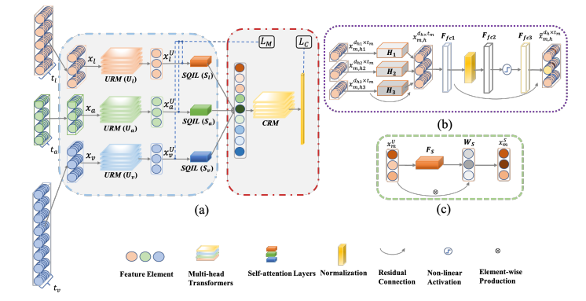

  

# Unimodal and Crossmodal Refinement Network for Multimodal Sequence Fusion

> Pytorch reimplementation.

## Paper
[**Unimodal and Crossmodal Refinement Network for Multimodal Sequence Fusion**](https://aclanthology.org/2021.emnlp-main.720.pdf)<br>
Xiaobao Guo, Adams Kong, Huan Zhou, Xianfeng Wang, Min Wang


## Overview

### Architecture of UCRN



As shown
in Figure above, UCRN is comprised of three main parts, where the first part conducts unimodal representation refinement, 
the second part refines all the previous information for fusion and learns a modality-common representation, and the last part
performs prediction. The Unimodal Refinement Module (URM) takes unimodal features 
(i.e., language, audio, vision features) as input to learn the refined unimodal representations. Then the refined unimodal 
representations are mapped to a common latent space by imposing a Multimodal Jenson-Shannon (MJS) divergence regularizer. 
Following this, the Self-Quality Improvement Layers (SQIL) are used to further extract desired weighted unimodal 
representations for fusion. Lastly, the Crossmodal Refinement Module (CRM) integrates all information 
and extracts multimodal interactions


### Datasets

Data files (containing processed MOSI, MOSEI datasets) can be downloaded from repo [here](https://github.com/yaohungt/Multimodal-Transformer).

For more information about datasets, please refer to the [SDK for datasets](https://github.com/A2Zadeh/CMU-MultimodalSDK).

For TBJE-MOSEI data, please refer to repo [here](https://github.com/jbdel/MOSEI_UMONS)

Note: the dataset for text features are not extracted from Bert_pretrained models, you may adapt them to Bert text features.

### Run the Code
1. Download data and put them in the folder "data/"
2. Create a folder for models "pre_trained_models/":
~~~~
mkdir data
mkdir pre_trained_models
~~~~
3. Settings for hyperparameters and run (refer to .sh files):
~~~
CUDA_VISIBLE_DEVICES=7 python main.py \
--model=UCRN --lonly --aonly --vonly \
--name='UCRN_bs32_jsd_mosei' \
--dataset='mosei_senti' --data_path='UCRN/data/' \
--batch_size=32 \
--seed=1234 --num_epochs=40 --when=20 \
--optim='Adam' --jsd \
--lr=0.001
~~~~
4. Other settings can be done by adjust hyperparameters, e.g., aligned/unaligned data.

Please cite the paper if you find the work useful for your research:

```tex
@inproceedings{guo2021unimodal,
  title={Unimodal and Crossmodal Refinnt Network for Multimodal Sequence Fusion},
  author={Guo, Xiaobao and Kong, Adams and Zhou, Huan and Wang, Xianfeng and Wang, Min},
  booktitle={Proceedings of the 2021 Conference on Empirical Methods in Natural Language Processing},
  pages={9143--9153},
  year={2021}
}
```

### Acknowledgement
Some codes were developed based on [Multimodal-Transformer](https://github.com/yaohungt/Multimodal-Transformer) repo.

